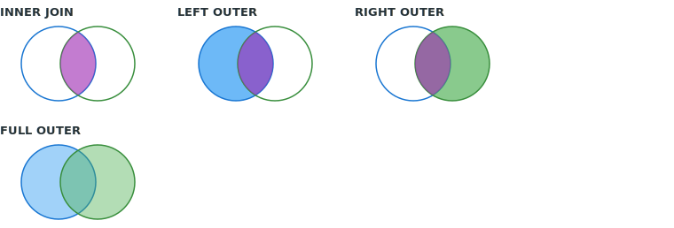

# SQL Joins

## Цель
Правильно соединять таблицы по ключам и условиям: понимать семантику `INNER` и `OUTER` джойнов, избегать неявного декартова произведения, выбирать между `IN`, `EXISTS` и джойном для полу- и анти-соединений.

## Виды соединений (логика)
| Операция | Что остаётся в результате |
| --- | --- |
| `INNER JOIN` | Только пары строк, удовлетворяющие условию соединения. |
| `LEFT [OUTER] JOIN` | Все строки из **левой** таблицы; из правой — совпадения или `NULL`, если пары нет. |
| `RIGHT [OUTER] JOIN` | Симметрично `LEFT`, если поменять местами таблицы; на практике часто переписывают в `LEFT` для единообразия. |
| `FULL [OUTER] JOIN` | Строки из обеих сторон; где нет пары — `NULL` с той стороны, где не нашлось совпадение. |

### Шаблоны по типу `JOIN`

Один и тот же ключ связи (`user_id`), разная семантика. Имена таблиц учебные.

```sql
-- INNER: только строки, где есть пара по условию в ON
SELECT *
FROM users u
INNER JOIN orders o ON o.user_id = u.id;

-- LEFT: все строки из users; для заказа может не быть пары (столбцы o.* — NULL)
SELECT *
FROM users u
LEFT JOIN orders o ON o.user_id = u.id;

-- RIGHT: все строки из orders; на практике чаще меняют порядок таблиц и пишут LEFT
SELECT *
FROM users u
RIGHT JOIN orders o ON o.user_id = u.id;

-- FULL: и «сироты» слева, и справа (нужна поддержка FULL OUTER JOIN в СУБД)
SELECT *
FROM users u
FULL OUTER JOIN orders o ON o.user_id = u.id;
```

### Какие столбцы попадают в результат

Результат джойна — это строки, в каждой из которых есть значения из **левой** и/или **правой** таблицы (в зависимости от типа `JOIN`). В `SELECT` вы сами задаёте проекцию: либо `*` (все столбцы обеих таблиц, имена при совпадении лучше уточнять префиксами `u.` / `o.`), либо **явный список** — так видно, откуда взят каждый столбец. При `LEFT`/`RIGHT`/`FULL` столбцы «второй» стороны без пары дают **`NULL`** в соответствующих ячейках.

```sql
-- Явные имена: откуда какое поле и как оно называется в результате
SELECT
  u.id              AS user_id,     -- всегда из users (левая таблица)
  u.email,
  o.id              AS order_id,     -- из orders; при отсутствии заказа будет NULL
  o.total_amount
FROM users u
LEFT JOIN orders o ON o.user_id = u.id;
```

Один и тот же логический столбец в двух таблицах (например `id`) в результате **два раза не сливается**: в списке `SELECT` их разводят префиксами или алиасами (`u.id` и `o.id`, как выше).

### Учебные таблицы и результат джойна

Ниже — вымышленные строки **без** `CREATE TABLE`. Связь в запросах: **`o.user_id = u.id`** (в `FROM` слева — `users u`, справа — `orders o`). У **Анны** два заказа (`10` и `13`) — видно, как при джойне **размножаются строки** пользователя («один ко многим»). У **Веры** нет заказа; заказ **`12`** ссылается на несуществующего пользователя **`99`** — в результатах `RIGHT` и `FULL` появляется строка с **`NULL`** в столбцах из `users`.

<div class="lenar-tip-grid lenar-sql-data-cards" markdown="block">

!!! note "Таблица `users`"

    | id | name  |
    | --- | --- |
    | 1 | Анна |
    | 2 | Борис |
    | 3 | Вера |

!!! note "Таблица `orders`"

    | id | user_id | amount |
    | --- | --- | --- |
    | 10 | 1 | 100 |
    | 13 | 1 | 150 |
    | 11 | 2 | 200 |
    | 12 | 99 | 50 |

</div>

Во всех примерах ниже один и тот же список столбцов в `SELECT`; отличается только тип **`JOIN`**.

**`INNER JOIN`** — только строки, где есть пара по ключу (Вера без заказа и заказ `12` без пользователя в результат не входят; у Анны две строки — по заказу `10` и по заказу `13`).

```sql
SELECT u.id, u.name, o.id, o.user_id, o.amount
FROM users u
INNER JOIN orders o ON o.user_id = u.id;
```

| u.id | u.name | o.id | o.user_id | o.amount |
| --- | --- | --- | --- | --- |
| 1 | Анна | 10 | 1 | 100 |
| 1 | Анна | 13 | 1 | 150 |
| 2 | Борис | 11 | 2 | 200 |

**`LEFT JOIN`** — все строки из левой таблицы (`users`). У Веры нет заказа — столбцы из `o` **`NULL`**. Заказ `12` в результат не входит: он «прикрепляется» только при наличии строки в `users` с `id = 99`.

```sql
SELECT u.id, u.name, o.id, o.user_id, o.amount
FROM users u
LEFT JOIN orders o ON o.user_id = u.id;
```

| u.id | u.name | o.id | o.user_id | o.amount |
| --- | --- | --- | --- | --- |
| 1 | Анна | 10 | 1 | 100 |
| 1 | Анна | 13 | 1 | 150 |
| 2 | Борис | 11 | 2 | 200 |
| 3 | Вера | NULL | NULL | NULL |

**`RIGHT JOIN`** — все строки из `orders`; для заказа `12` нет пользователя — слева **`NULL`**.

```sql
SELECT u.id, u.name, o.id, o.user_id, o.amount
FROM users u
RIGHT JOIN orders o ON o.user_id = u.id;
```

| u.id | u.name | o.id | o.user_id | o.amount |
| --- | --- | --- | --- | --- |
| 1 | Анна | 10 | 1 | 100 |
| 1 | Анна | 13 | 1 | 150 |
| 2 | Борис | 11 | 2 | 200 |
| NULL | NULL | 12 | 99 | 50 |

**`FULL OUTER JOIN`** — объединение обоих случаев: и пользователь без заказа (Вера), и заказ без пользователя (`12`). Нужна поддержка конструкции в СУБД.

```sql
SELECT u.id, u.name, o.id, o.user_id, o.amount
FROM users u
FULL OUTER JOIN orders o ON o.user_id = u.id;
```

| u.id | u.name | o.id | o.user_id | o.amount |
| --- | --- | --- | --- | --- |
| 1 | Анна | 10 | 1 | 100 |
| 1 | Анна | 13 | 1 | 150 |
| 2 | Борис | 11 | 2 | 200 |
| 3 | Вера | NULL | NULL | NULL |
| NULL | NULL | 12 | 99 | 50 |

Порядок строк во `FULL OUTER JOIN` в разных СУБД может отличаться; состав строк для данного набора данных — как в таблице выше (всего пять строк).

### Схема: два множества строк

Ниже — **учебная** картинка «два круга»: таблица **A** (левый круг) и **B** (правый). Пересечение — строки, где условие в `ON` выполняется в обеих таблицах. Реальный запрос задаёт ключ и семантику точнее, чем рисунок, но для запоминания типов `JOIN` такая диаграмма часто помогает.

<figure class="lenar-sql-figure" markdown="1">



<figcaption>Фиолетовое пересечение — совпадения по ключу. У <code>LEFT</code>/<code>RIGHT</code>/<code>FULL</code> в результат попадают и строки без пары (в столбцах «другой» стороны — <code>NULL</code>).</figcaption>
</figure>

Условие соединения почти всегда в `ON`. Дополнительные фильтры по **правой** таблице для `LEFT JOIN` безопаснее класть в `ON`, если хотите сохранить строки левой стороны; фильтр в `WHERE` на правую таблицу может превратить внешний джойн в фактически внутренний (исключив `NULL`). Разбор на запросах — в разделе «Примеры» ниже (блок про условие на правую таблицу).

## Декартово произведение
Возникает, когда соединение задано неполно или забыты условия: `FROM a, b` без `WHERE` / `ON` даст все комбинации строк `a` × `b`. На больших таблицах это быстро становится катастрофой по ресурсам.

```sql
-- Так получается декартово произведение (каждая строка users × каждая строка orders):
SELECT *
FROM users u, orders o;

-- Обычно нужна связь по ключу:
SELECT *
FROM users u
JOIN orders o ON o.user_id = u.id;
```

## Полу-джойн и анти-джойн
Не всегда нужны столбцы из второй таблицы — иногда важен только факт **существования** совпадения. Тогда удобны `EXISTS` и `NOT EXISTS` (см. примеры ниже).

`NOT IN (подзапрос)` опасен, если подзапрос может вернуть `NULL`: итоговое условие может исключить все строки. `NOT EXISTS` таким артефактом не страдает.

## Самосоединение
Та же таблица под разными алиасами — типично для иерархий (`employee.manager_id = boss.id`). Шаблон с двумя копиями таблицы — в [шаблонах запросов](../../cheatsheets/query-patterns.md).

```sql
SELECT e.id AS employee_id, e.name, m.name AS manager_name
FROM employees e
LEFT JOIN employees m ON m.id = e.manager_id;
```

## Несколько джойнов
Порядок соединений задаётся цепочкой `JOIN`; оптимизатор обычно переупорядочивает выполнение, но **семантика** должна следовать из ваших `ON` и типов джойнов. При сомнениях проверьте план и число строк на промежуточных шагах.

```sql
SELECT u.id, o.id AS order_id, p.amount
FROM users u
JOIN orders o ON o.user_id = u.id
JOIN payments p ON p.order_id = o.id
WHERE u.active = TRUE;
```

## Примеры

Ниже — только то, что проще понять на запросе, чем на абзаце: полу-/анти-джойн, аккуратный подсчёт через `LEFT JOIN`, и типичная ошибка с условием на правую таблицу после внешнего соединения.

<div class="lenar-tip-grid" markdown="block">

!!! note "Полу-джойн и анти-джойн"

    Нужен только факт наличия или отсутствия строк во второй таблице — без лишних столбцов из неё.

    ```sql
    SELECT u.id
    FROM users u
    WHERE EXISTS (
      SELECT 1 FROM orders o WHERE o.user_id = u.id
    );
    ```

    ```sql
    SELECT u.id
    FROM users u
    WHERE NOT EXISTS (
      SELECT 1 FROM orders o WHERE o.user_id = u.id
    );
    ```

!!! note "LEFT JOIN: счётчики без размножения строк пользователя"

    Сначала агрегат по заказам, потом присоединение к `users` — иначе «один-ко-многим» завысит суммы.

    ```sql
    SELECT u.id, COALESCE(o.cnt, 0) AS order_count
    FROM users u
    LEFT JOIN (
      SELECT user_id, COUNT(*) AS cnt
      FROM orders
      GROUP BY user_id
    ) o ON o.user_id = u.id;
    ```

!!! note "Условие на правую таблицу: `ON`, не `WHERE`"

    Нужны **все** пользователи, а заказы — только за последние 7 дней; где заказа нет, столбцы заказа будут `NULL`. Если то же условие перенести в `WHERE`, строки без подходящего заказа отвалятся (фильтр по `NULL` уберёт «пустых» слева).

    ```sql
    -- задумано: все пользователи, заказ за 7 дней или NULL
    SELECT u.id, o.id AS order_id
    FROM users u
    LEFT JOIN orders o
      ON o.user_id = u.id
     AND o.created_at >= CURRENT_DATE - INTERVAL '7 days';
    ```

    ```sql
    -- частая ошибка: остаются только те, у кого есть заказ в окне
    SELECT u.id, o.id AS order_id
    FROM users u
    LEFT JOIN orders o ON o.user_id = u.id
    WHERE o.created_at >= CURRENT_DATE - INTERVAL '7 days';
    ```

</div>

## Частые ошибки
- Фильтр по правой таблице в `WHERE` после `LEFT JOIN`, который убирает «непришедших» из правой части — неожиданно для читателя; явно переходите на `INNER` или переносите условие в `ON`.
- Неявное декартово произведение из-за опечатки в ключе или лишней таблицы в `FROM`.
- `SELECT *` в промежуточных больших джойнах без необходимости — лишний объём и риск незаметного дублирования строк.
